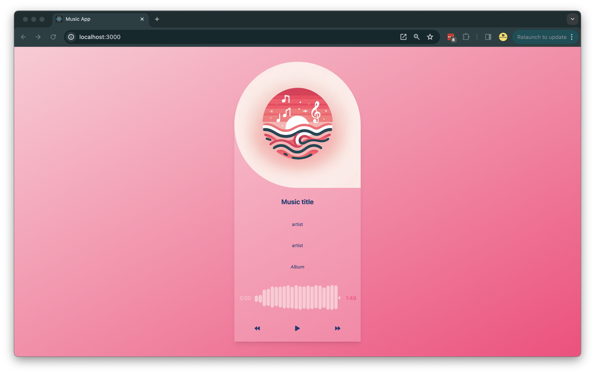

# ASMR-Music Player Readme

Welcome to ASMR-Music Player, a unique music player application developed with ReactJS and TailwindCSS. This innovative music player not only lets you enjoy your favorite tunes.

## YouTube link

https://youtu.be/J9FCfIX26to 
## Screenshots

## Features

- **Play Music:** Stream your favorite tracks seamlessly.
- **Background Play:** Continue listening to your music while using other apps.
- **Volume Control:** Adjust the volume of music independently.

## Technologies Used

- **ReactJS**: A popular JavaScript library for building user interfaces.
- **TailwindCSS**: A utility-first CSS framework for creating custom designs quickly.

## Installation and Usage

1. Clone the repository to your local device.
2. Open the project directory.
3. Execute `npm install` to install all dependencies.
4. Launch the development server with `npm start`.
5. The application will be available in your web browser at `http://localhost:3000`.

## How to Contribute

We encourage contributions! To contribute enhancements, new features, or fixes to Music Player, please follow these steps:

1. Fork the repository.
2. Switch to a new branch for your feature (`git checkout -b feature/new-feature`).
3. Implement your changes.
4. Commit the changes (`git commit -am 'Add some new-feature'`).
5. Push the branch (`git push origin feature/new-feature`).
6. Submit a pull request with a detailed description of your work.

## License

ASMR-Music Player is made available under the MIT License - for more information, see the [LICENSE](LICENSE) document.

---

Discover more videos on the channel. Enjoy your music and relax with ASMR-Music Player! 🌟
